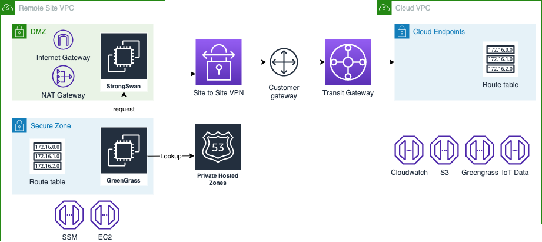

# AWS IoT Greengrass Private Networking with AWS PrivateLink

This is a python 3 based CDK solution that will build out the resources required to establish a private network between an OT site and cloud based AWS IoT services using AWS IoT Greengrass. You can learn more about how this solution helps secure industry 4.0 architectures by visiting the companion AWS IoT Blog  [How to securely connect an AWS IoT Greengrass v1 device to AWS IoT Core using AWS PrivateLink](https://aws.amazon.com/blogs/iot/how-to-securely-connect-an-aws-iot-greengrass-v1-device-to-aws-iot-core-using-aws-privatelink/)

## Overview

This solution creates a simulated OT network VPC with  public and private subnets as well as a cloud based VPC with a single isolated subnet. An AWS Site to Site VPN will be installed to connect the OT and cloud networks over a private connection. The solution configures PrivateLink VPC Endpoints for the AWS services that AWS IoT Greengrass interacts with. In addition an EC2 instance is setup in the remote private subnet where you can install AWS IoT Core Greengrass. Before you start be sure to choose a [region](https://docs.aws.amazon.com/general/latest/gr/greengrass.html) that supports AWS IoT Greengrass. This solution has been tested in us-west-2.



## Prerequisites
Ensure that you have a base understanding of AWS IoT, AWS VPC networking, AWS EC2 and AWS CDK and AWS IoT Core. You can learn how to install and configure the AWS CDK with this [getting started guide](https://docs.aws.amazon.com/cdk/v2/guide/getting_started.html) before running this solution. 

## Instructions

You can install this solution into your environment by first cloning this Git repository, then cd into `aws-greengrass-private-network` directory. 
Next create a Python3 virtual environment and activate it. 
 
```
$ python3 -m venv .venv
```

After the init process completes and the virtualenv is created, you can use the following
step to activate your virtualenv.

```
$ source .venv/bin/activate
```

Once the virtualenv is activated, you can install the required dependencies.

```
$ pip install -r requirements.txt
```

In addition this stack requires you to set three environment variables to properly configure CDK before deploying. Make sure you replace the values between the brackets <> with your valid values. Note that the below example is for common linux shells like sh, bash, or zsh.

```
export GREENGRASS_MODE=VPNexport CDK_DEPLOY_ACCOUNT=<AWS_ACCOUNT>
export CDK_DEPLOY_REGION=<AWS_REGION>

```

Or if you use a Linux based shell use and you use the cli tool [jq](https://stedolan.github.io/jq/) you can run the following commands instead of the preceding. 

```
export GREENGRASS_MODE=VPN
export CDK_DEPLOY_ACCOUNT=$(aws sts get-caller-identity | jq -r .Account)
export CDK_DEPLOY_REGION=$(aws configure get region)
```

You are now ready to bootstrap the CDK in your account if you have not already done so. When you run these commands you should see the first line of output "Greengrass v1 VPN mode". If you do not see VPN in that output your GREENGRASS_MODE is not setup correctly. 

```
cdk bootstrap
```

And deploy the greengrass private network stack

``` 
cdk deploy
```

**Important** At this time there is a bug in the CDK for returning the Transit Gateway ID that will cause the stack to rollback when setting up routes from your greengrass private subnet to the TGW that routes traffic to the VPN Customer Gateway. To solve this we'll deploy each stack separately.

``` 
cdk deploy greengrass-private-network-tgw
cdk deploy greengrass-private-network-vpn
```


Without this your VPC Endpoints won't propagate to the remote VPC.

## VPN setup

The next step is to connect your VPCs with a Site to Site VPN connection. For this you can follow the instructions in the AWS blog [Simulating Site-to-Site VPN Customer Gateways Using strongSwan](https://aws.amazon.com/blogs/networking-and-content-delivery/simulating-site-to-site-vpn-customer-gateways-strongswan/). It is beneficial to read the blog for context; the CDK solution we just installed already setup the VPCs, Transit Gateway, Elastic IP, and Customer Gateway as required. You can pick up at step **4. Download the VPN tunnel configuration**. There is a copy of the CloudFormation stack ready for you to upload to configure the VPN located in ./greengrass_private_network/vpn-gateway-strongswan.yml. Once you reach step **7. Test the VPN connection** you will only need to modify one existing route rather than adding a new one. 

Your Ec2 instance for Greengrass in the remote secure zone subnet currently has access to the internet via a NAT Gateway. Locate the subnet which the Ec2 instance is running in and modify the route table entry for **0.0.0.0/0** to point to your EIP identified in your CDK or CloudFormation outputs instead of the NAT Gateway. This change cuts off internet communication making all of your remote site Greengrass traffic private. 

## AWS IoT Greengrass Configuration

Now that your VPN is configured you are ready to  configure the AWS IoT Greengrass runtime. The Greengrass instance is setup for Systems Manger Session Manager so that you can easily connect from the AWS Console without SSH or an SSH key pair. On the EC2 console select the Greengrass EC2 instance then choose Connect and once on the Connect screen choose the Session Manager tab. Note that as of today AWS Greengrass v2 will not run in a completely isolated subnet, so for the time being this solution configures IoT GreenGrass v1. An update will be published to this repository enabling a proxy configuration running in the cloud VPC to enable Greengrass V2 private networking.

To install AWS IoT Greengrass v1, go to the console and connect to your instance using AWS Systems Manager. Then you can follow [Module 2: Installing the AWS IoT Greengrass Core software](https://docs.aws.amazon.com/greengrass/v1/developerguide/module2.html). 

You are able to skip Module 1 as the CDK stack already setup the EC2 instance with required dependencies. Since your instance does not have internet access I've configured the instance profile with permissions to a specific S3 bucket. Download your IoT Thing certificate files as well as the greengrass binary to an S3 bucket you can create. You'll need the "Armv8 (AArch64) Linux" version for the EC2 instance setup in this solution. 

In the S3 console create an S3 bucket called greengrass-setup-<account_id> substituting your account id. Then upload the required certificates and the AWS IoT Greengrass runtime. Next you can download these files from your bucket to your EC2 instance and proceed with the setup instructions. Be sure you are in the home directory with the command `cd ~` then run the following command in your EC2 Systems Manager CLI session. Be sure to replace your account id and file name for setup before running these. If you use a folder in the bucket be sure to adjust your command accordingly. 

```
cd ~
aws s3 sync s3://greengrass-setup-<ACCOUNT_ID>/ .
```

Now that you have the required files in place, resume with the instructions [Start AWS IoT Greengrass on the core device](https://docs.aws.amazon.com/greengrass/v1/developerguide/gg-device-start.html) at Step 4. Install the AWS IoT Greengrass Core software and the security resources. 

## Private Network Validation

In a private network we use VPC Endpoints to establish private DNS lookups to interact with AWS services like IoT, IoT Greengrass, and S3. You can validate endpoints with nslookup before firing up Greengrass as well. For the last value you'll need to replace the hash with your IoT Core endpoint value which you can find on your IoT Core Console on the Setting page. If your DNS lookup is hitting your endpoint you'll see IP addresses within hte CIDR range of your cloud side VPC which is 172.16.1.0/24.

```
nslookup greengrass-setup-<account_id>.s3.<region>.amazonaws.com
nslookup greengrass-ats.iot.<region>.amazonaws.com
nslookup logs.<region>.amazonaws.com
nslookup <hash>-ats.iot.<region>.amazonaws.com
```

For each lookup, once you've replaced the values in brackets, you will see endpoints resolve inside the VPC CIDR block range for your private network. You can see this CIDR block range printed in the CDK output, the value will be similar to `greengrass-private-network-vpn.CloudGreengrassVPCCIDRBlock = 172.16.1.0/24`

Output from nslookup commands that show endpoint addresses in your private network VPC CIDR Range will look similar to the following with an entry for each associated subnet:

```
$ nslookup greengrass-ats.iot.us-west-2.amazonaws.com
Server:         172.16.0.2
Address:        172.16.0.2#53

Non-authoritative answer:
Name:   greengrass-ats.iot.us-west-2.amazonaws.com
Address: 172.16.1.71
Name:   greengrass-ats.iot.us-west-2.amazonaws.com
Address: 172.16.1.132
```

Next on the IoT Core console, browse to Test and choose MQTT Test Client and subscribe to the **Topic filter** with a value of **#** which will echo all messages. Now in your EC2 instance SSM session, start or restart Greengrass if you've already started it.

```
cd /greengrass/ggc/core/
sudo ./greengrassd start
```

You should see several MQTT messages from Greengrass showing your private connectivity flowing through your VPC Endpoints in your isolated subnets. You have validated your endpoints and Greengrass connectivity, but have only exercised the IoT Core endpoint for MQTT communications. 

You can take this a step further by working through Module 3 parts 1 and 2 [Lambda Functions on AWS IoT Greengrass](https://docs.aws.amazon.com/greengrass/v1/developerguide/module3-I.html).

You are now ready to connect your OT network to your greengrass-private-network VPC. You can also opt to delete your NAT Gateway, Internet Gateway and public subnets, or customize the CDK stack to align with your networking requirements.


